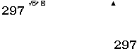
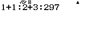
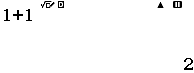
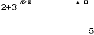
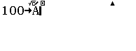
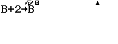
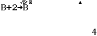
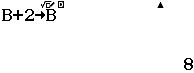

# Casioooo
Note: Mình đang sử dụng chiếc Casio fx-580 trong bài viết này vì nó có nhiều tính năng nhất nhé :D


## Những gì ta không có
Trước hết, ta phải cùng đồng ý về những thứ mà ta không thể có được/những khó khăn lớn nhất.

### Tính tương tác với máy
Để có thể tương tác với chương trình trên máy sẽ không đơn giản như bình thường, ta sẽ cần lưu ý là sẽ hoàn toàn không có những tác vụ nhập xuất bình thường, không thể đơn giản như `input()` trong Python hay `cin` trong C++, mà ta sẽ phải sử dụng các biến của máy để có thể giao tiếp với chương trình.

Và tất nhiên là sẽ không thể có những thứ cao hơn như key input.

### Tính tự động hóa
Ta sẽ phải chạy lệnh một cách thủ công, không tự động hóa.

### Giới hạn văn bản
Nếu mình không nhầm thì bạn chỉ có thể gõ khoảng 200 ký tự trên Casio fx-580.

### Sao lưu
Bạn sẽ phải nhập lại chương trình từ đầu với mỗi lần chuyển chương trình, không thể lưu lại (trừ khi bạn có thể đi modify được phần cứng :\|)

### UI/UX
Vì nó không sinh ra với mục đích để lập trình, nên UI tất nhiên sẽ không vừa mắt, không có đồ họa và trải nghiệm dùng khá... không vui :)

### String
Bạn sẽ không có string! (Mặc dù bạn có thể xử lý theo ASCII một cách thủ công)


## Những khái niệm lập trình cơ bản

### Câu lệnh
Với chiếc máy tính Casio của chúng ta, các câu lệnh sẽ được biểu diễn dưới dạng các phép tính, mọi phép tính đều là câu lệnh (aka expression trong ngôn ngữ lập trình bình thường).

Và kết quả sẽ luôn được in ra nên ta đã có cho mình tính năng output :D

Ví dụ:



Từ đó, qua khả năng tính nhiều phép tính bằng `:`, ta cũng có thể chạy nhiều câu lệnh bằng cách ấn dấu `=` liên tiếp:








### Biến
Chúng ta đã có sẵn 10 ô biến A, B, C, D, E, F, x, y, z, M, kèm theo đó là một số biến đặc biệt như Ans và PreAns để truy vết các đáp án từ các phép tính trước.

Nếu như bạn chưa biết lưu giá trị vào biến như thế nào, thì đơn giản chỉ là bấm giá trị cần lưu, bấm `STO`, rồi bấm vào nút có tên biến ở trên tương ứng, cuối cùng bấm phím trái và ta sẽ có kết quả giống như sau:



Khi ta bấm `=` thì `100` sẽ được lưu vào biến `A`.

### Vòng lặp
Ta không thực sự có vòng lặp, nhưng `:` đã cho chúng ta một thứ gần giống thế, mỗi khi ta chạy đến phép tính cuối, chương trình tự nhảy về phép tính đầu (hay câu lệnh đầu), từ đó ta đã có vòng lặp.

Như vậy, ta có thể viết một chương trình cộng 2 liên tục vào một biến như sau:



Ấn `=` liên tục ta có:






### Cấu trúc rẽ nhánh
Để tạo cấu trúc rẽ nhánh, bạn cần có một phép tính *dựa vào biến* sao cho khi giá trị của biến thay đổi thì giá trị trả về cũng thay đổi theo một cách nào đó. Lưu ý là không thực sự có một cách nào *chung* để tạo cấu trúc rẽ nhánh, đơn giản thì khái niệm cấu trúc rẽ nhánh ở đây chỉ là những phép tính dựa vào điều kiện của biến mà thôi.

Ví dụ, mình có một phép tính như sau: Nếu A không chia hết cho B thì lấy số dư nhân với C, còn không thì trả về 0.

```
(A-(B*Int(A/B)))*C
```

Giải thích: Đầu tiên mình tìm được thương qua A/B, sau đó mình chỉ lấy phần nguyên nhân với B, trừ A cho kết quả vừa có được ta có số dư, nếu không dư thì tức là dư 0, thì nhân với mọi số đều bằng 0, còn nếu dư khác 0 thì ta có kết quả là số dư nhân với C.

Có một số trường hợp khá thú vị như bài toán tìm số lớn nhất trong hai số, ta có thể dùng công thức tổng cộng hiệu tất cả chia 2, hay `((a+b)+|a-b|)/2`, nhưng thực chất thì giá trị tuyệt đối khá giống một cấu trúc rẽ nhánh - nếu số không âm thì giữ nguyên, nếu số âm thì biến nó thành số dương => phép màu của toán học :D

**Như vậy, để rẽ nhánh, hãy vận dụng sự sáng tạo của bạn với toán học.**

#### Báo lỗi
Ta có thể vận dụng tính chất số học cho điều này, chẳng hạn như phép chia cho 0 chẳng hạn.

Chẳng hạn như bạn muốn báo lỗi khi nhập vào một số quá giá trị cho phép, thì bạn có thể làm như sau:

(Giả sử dữ liệu nhập vào lưu vào biến A, giá trị cho phép là biến B)

```
1 / ( ((B-A+0) + |B-A-0|) / 2 )
```

Giải thích: Áp dụng cách lấy số lớn nhất nêu trên, nếu như A >= B, thì B-A sẽ bé hơn 0, nên số lớn nhất giữa hai số là 0 và phép tính sẽ chia cho 0 (máy sẽ báo lỗi `Math Error`), còn đâu thì chia cho B-A, chạy bình thường.

### Casio là một cỗ máy toán học mạnh mẽ
Bạn nên nhớ là máy cũng có vô vàn tính năng rất mạnh, như các hàm số toán học, các hàm `RndInt`, `Int`, `Intg`, các phép đổi đại lượng,... nên hãy tận dụng triệt để chúng nhé!

## Một số chương trình cơ bản

### Fibonacci:
Note: Nếu bạn không biết Fibonacci là gì thì nó là một dãy số gồm các số Ai với Ai+2 = Ai+1 + Ai, ví dụ: `1, 1, 2, 3, 5, 8, 13, 21,...`.

Các biến khai báo trước:
```
0->A
1->B
0->C
```

Code:
```
A+B->C:B->A:C->B
```

(Hãy bấm `=` liên tục và bạn sẽ thấy màn hình khi ở phép tính `A+B->C` sẽ có kết quả liên tiếp là các số trong dãy Fibonacci).

### Kiểm tra số nguyên tố
Các biến khai báo trước:
```
<dau vao cua ban>->A
2->B
```

```
RanInt#(0, A-B):1/(A-B*Int(A/B)):B+1->B
```

Chương trình sẽ báo lỗi `Math Error` khi số chia hết cho số nào đó, chương trình sẽ báo lỗi `Argument Error` khi vượt quá số đã cho (tức số đã cho chính là số nguyên tố).

Giải thích: Nếu A bằng B thì A-B bằng 0 thì ta có `RanInt#(0, 0)` báo lỗi `Argument Error`, tại đây ta dừng, còn nếu A chia hết cho B thì `(A-B*Int(A/B))` bằng 0 thì 1 chia 0 sẽ báo lỗi, sau đó ta cộng 1 vào B sau một lần kiểm tra.

### Lấy số lớn hơn giữa 2 số:
Các biến khai báo trước:
```
<so thu nhat>->A
<so thu hai>->B
```

Code:
```
(A+B+|A-B|)/2
```

Note: Nếu bạn không biết lấy giá trị tuyệt đối từ đâu thì nó là `Shift`-`(` nhé! 

### Lấy số nhỏ hơn giữa 2 số:
Các biến khai báo trước:
```
<so thu nhat>->A
<so thu hai>->B
```

Code:
```
(A+B-|A-B|)/2
```


## Contributors
* Nguyễn Phú Minh
